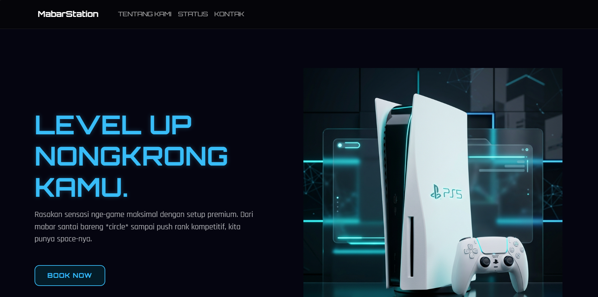
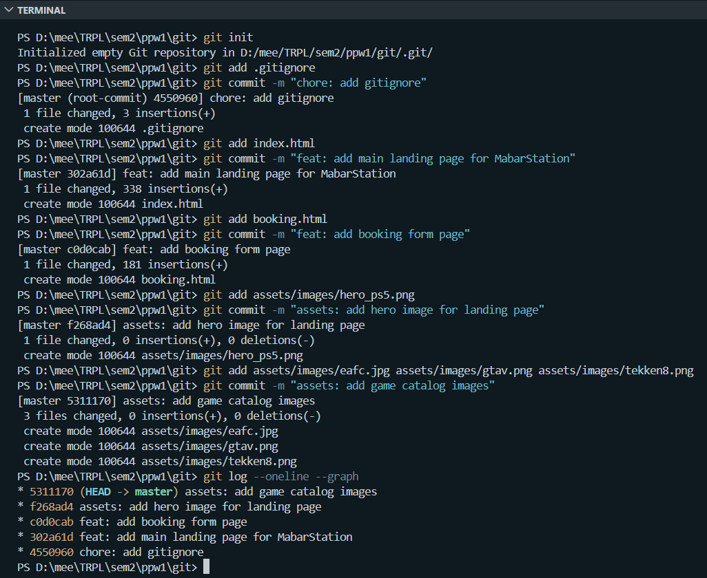
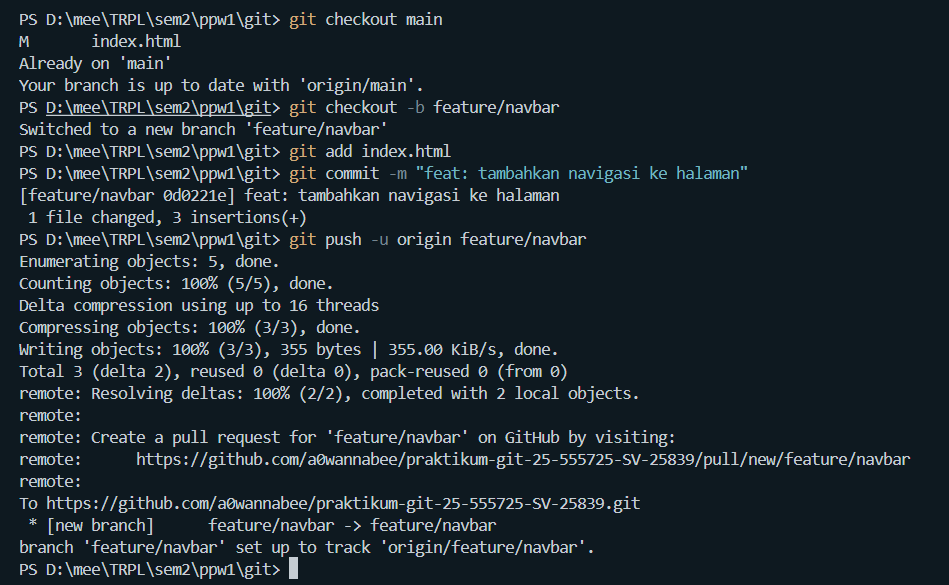
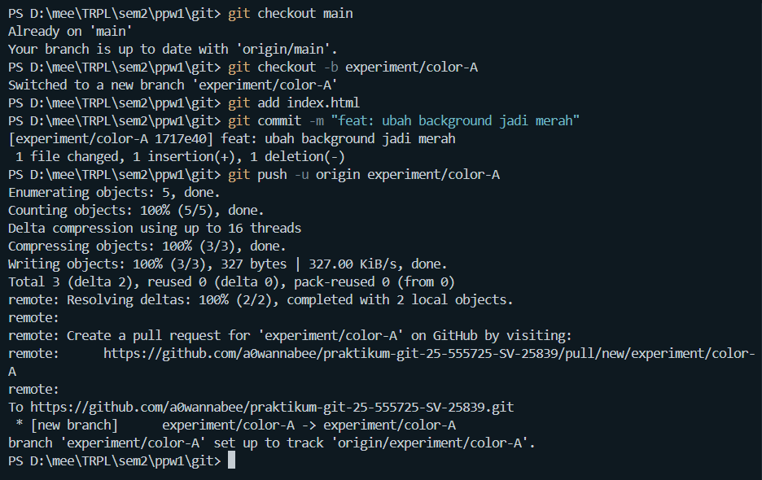
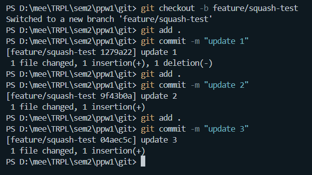
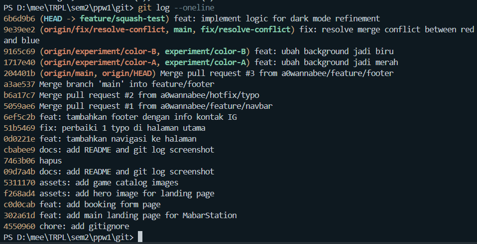

1. Deskripsi Proyek
MabarStation adalah platform website interaktif yang dirancang sebagai pusat komunitas gamer untuk mencari teman "Main Bareng" (mabar).

2. Cara Menjalankan
Untuk melihat proyek ini secara lokal, ikuti langkah-langkah berikut:
  1. Lakukan clone repository ini: `git clone https://github.com/a0wannabee/praktikum-git-25-555725-SV-25839.git`
  2. Buka folder proyek tersebut menggunakan *code editor* seperti Visual Studio Code.
  3. Jalankan file `index.html` di browser Anda.

Berikut adalah dokumentasi hasil pengerjaan:
  1. Screenshot Tampilan Website
 
  2. Screenshot Git Log (Bukti Conventional Commits)

  3. Screenshot Branch Protection Rule

3. Dokumentasi Perintah Git
| Perintah | Penjelasan Singkat |
| :--- | :--- |
| `git clone <url>` | Menggandakan repositori dari GitHub ke dalam komputer lokal. |
| `git status` | Mengecek status dari working directory dan staging area. |
| `git add .` | Menambahkan semua perubahan file ke dalam staging area sebelum di-commit. |
| `git commit -m "pesan"` | Menyimpan perubahan ke riwayat lokal sesuai format Conventional Commits. |
| `git log --oneline --graph` | Menampilkan riwayat commit secara ringkas dalam format grafik. |
| `git checkout -b <nama>` | Membuat branch baru sekaligus berpindah ke branch tersebut. |
| `git branch` | Melihat daftar seluruh branch lokal yang ada. |
| `git push origin <branch>` | Mengirimkan riwayat commit lokal ke repositori di GitHub. |
| `git pull origin main` | Mengambil dan menggabungkan pembaruan terbaru dari GitHub ke lokal. |
| `git rebase -i HEAD~3` | Melakukan interactive rebase untuk menggabungkan atau squash 3 commit terakhir. |

